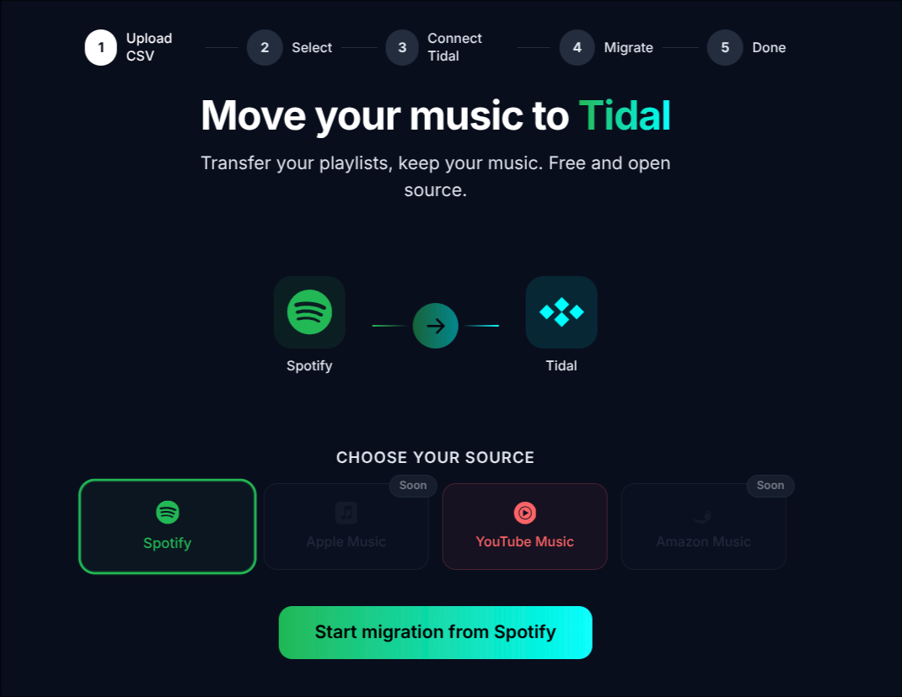

#  Tuneshift

**Free, open-source tool to migrate your Spotify playlists to Tidal.**

No account needed. No data stored. Just upload, connect, and migrate.

<p align="center">
  
</p>

## How it works

```
Export playlists from Spotify  ->  Upload CSV  ->  Connect Tidal  ->  Done
         (via Exportify)
```

1. Export your Spotify playlists at [exportify.app](https://exportify.app)
2. Upload the CSV files to Tuneshift
3. Select which playlists to migrate
4. Connect your Tidal account
5. Hit migrate - tracks are matched by ISRC, playlists created on Tidal

## Track matching

Tuneshift uses a two-step matching strategy:

- **ISRC lookup** - Most tracks have an International Standard Recording Code. This gives exact matches.
- **Fuzzy search** - Falls back to searching by track name + artist with smart normalization (strips remaster tags, handles spelling variations, duration matching).

In testing, **91/91 tracks** matched successfully with ISRC data from Exportify.

## Self-hosting

Tuneshift is designed to run on your own server via Docker.

### Prerequisites

- A server with Docker installed
- A [Tidal Developer](https://developer.tidal.com) app (free, takes 2 minutes)

### Setup

```bash
git clone https://github.com/Eliesmbr/Tuneshift.git
cd Tuneshift
cp .env.example .env
```

Edit `.env`:

```env
TIDAL_CLIENT_ID=your_tidal_client_id
BASE_URL=https://yourdomain.com
```

Set the Tidal redirect URI to `https://yourdomain.com/api/auth/tidal/callback`

### Run

```bash
docker compose up --build -d
```

The app runs on port `8080`. Put a reverse proxy (Caddy, Nginx) in front for HTTPS.

## Architecture

```
┌──────────────────────────────────────┐
│           Docker Container           │
│                                      │
│   React SPA  <-──  Go Backend :8080   │
│   (static)       │                   │
│                  API + OAuth + SSE   │
└──────────────────┼───────────────────┘
                   │
          Tidal API (openapi.tidal.com/v2)
```

- **Backend:** Go (standard library, zero dependencies)
- **Frontend:** React + Tailwind CSS
- **Auth:** Tidal OAuth 2.0 with PKCE
- **Sessions:** AES-256-GCM encrypted HTTP-only cookies
- **Progress:** Server-Sent Events (SSE) for real-time updates
- **Image size:** ~15 MB

## Security

- No database, no user accounts - fully stateless
- OAuth tokens encrypted in HTTP-only cookies, never exposed to JavaScript
- PKCE flow - no client secret needed
- CSRF protection via OAuth state parameter + SameSite cookies
- Rate limiting on all API endpoints
- Container runs as non-root user
- CSV files parsed in memory, auto-deleted after 30 minutes

## Why not use the Spotify API directly?

> [!NOTE]
> Since February 2026, Spotify requires a Premium subscription for Web API access and limits new developer apps to just 5 manually allowlisted users. Extended quota mode (unlimited users) is only available to registered companies with 250k+ monthly active users.
>
> This makes it impossible for new open-source projects to use the Spotify API directly. Tuneshift uses [Exportify](https://exportify.app) as a workaround - Exportify's Spotify app was registered before these restrictions and is grandfathered in with full API access. Users export their playlists as CSV files through Exportify, then upload them to Tuneshift for migration to Tidal.
>
> More details: [Spotify February 2026 Migration Guide](https://developer.spotify.com/documentation/web-api/tutorials/february-2026-migration-guide)

## Tech stack

| Component | Technology |
|-----------|-----------|
| Backend | Go 1.22+ (net/http) |
| Frontend | React 19, Tailwind CSS 3 |
| Build | Multi-stage Docker (Node + Go + Alpine) |
| Auth | OAuth 2.0 + PKCE |
| Encryption | AES-256-GCM |
| Progress | Server-Sent Events |
| Matching | ISRC + fuzzy search |

## License

MIT
